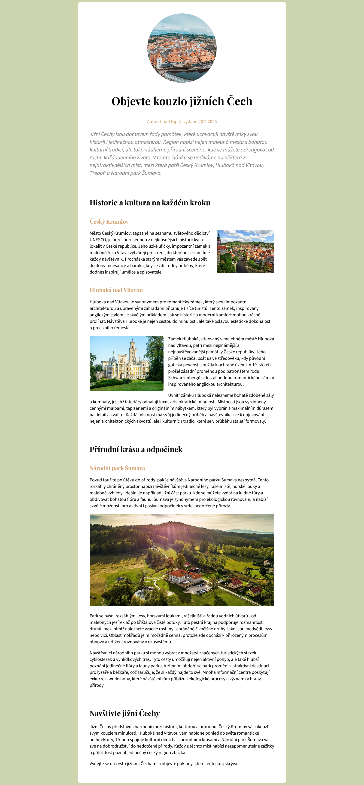

# Projekt Jižní Čechy

*Cvičný projekt pro kurz HTML a CSS (blended) od Czechitas.*

- Obsah v HTML zabal do správných značek.
- Připoj CSS soubor.
- Nastyluj stránku podle zadání níže.
- Na výsledek se můžeš podívat v obrázku **ukazka-vysledku.jpg** (připojený na konci stránky).

## Písma

Písma z [Google Fonts](https://fonts.google.com):
- **Playfair Display** pro všechny nadpisy (h1, h2, h3)
- **Source Sans 3** pro všechny ostatní texty na stránce

### Text na stránce
- velikost 20px
- rozestup mezi řádky 1.4

### Všechny nadpisy
- rozestup mezi řádky 1.2

### Nadpis H1
- velikost 48px
- vycentrovaný

### Nadpis H2
- velikost 32px

### Nadpis H3
- velikost 24px
- barva #d4a373
- odsazení od okolních prvků shora 48px

### Perex a autor
- odstavec s autorem a datem vydání je vycentrovaný a hn2dou barvou #d4a373
- perex (úvodní odstavec článku) má velikost písma 24px a šedou barvu #808080

---

## Barvy

- pozadí stránky: #ccd5ae
- autor a nadpisy H3: #d4a373
- perex (úvodní odstavec textu): #808080
- pozadí článku: bílá, #ffffff

---

## Článek

- bílá barva pozadí
- šířka 900px
- odsazení směrem dovnitř 30px ve vertikálním a 50px v horizontálním směru
- zaoblení rohů 12px

---

## Obrázky

- Pokud jsou obtékáné textem, mají od textu odsazení 20px zleva/zprava a dole.
- Mají zaoblené rohy 8px.
- Velký obrázek je široký 100% a m8 odsayen9 naho5e a dole 20px.

**Velikosti obrázků:**
- úvodní *jizni-cechy.jpg* - 300x300
- *cesky-krumlov.jpg* - 250x188
- *hluboka.jpg* - 320x240
- *sumava.jpg* - přes celou šířku, 100%

---

## Ukázka výsledku

